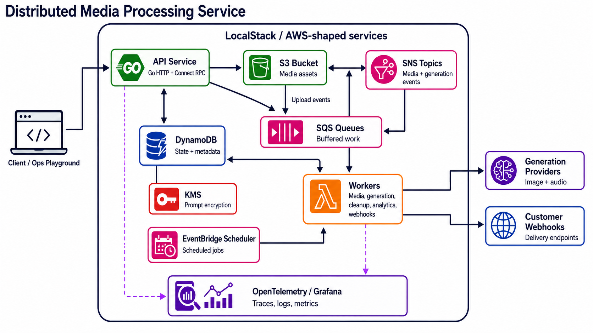

# Distributed Media Processing Service

An event-driven media platform built with Spring Boot, AWS Lambda, and S3/DynamoDB. It supports multi-tenant uploads, asynchronous asset generation, analytics, short links, and operational tooling.

## Overview

- Upload media via direct multipart (up to 50MB) or presigned S3 flow (up to 1GB)
- Process image and document assets asynchronously through SNS/SQS + Lambda
- Create derived assets on demand (`image.process`, `image.thumbnail`, `document.preview`, `document.text`)
- Extract PDF metadata/text and generate document preview images
- Manage auth with tenant-scoped JWT and API keys
- Track analytics (views/downloads, top media, format usage, summary)
- Generate and revoke short URLs for specific media assets
- Operate DLQ replay/delete/purge endpoints for failed message handling

## Architecture



Key design choices:

- SNS/SQS buffering decouples API ingestion from processing workload
- Asset-based processing model allows multiple outputs per media item
- Soft delete keeps metadata for analytics and audit while removing S3 objects
- OpenTelemetry traces flow API -> SNS/SQS -> Lambda for end-to-end visibility

## Core Workflows

1. Upload media (`/v1/media/upload` or `/v1/media/upload/init` + `/upload/complete`).
2. API stores original asset in S3 + metadata in DynamoDB.
3. Client requests derived assets via `POST /v1/media/{mediaId}/assets`.
4. Lambda processes jobs and updates per-asset + media status.
5. Client fetches assets, download links, and analytics through API/Web UI.

## Security and Tenancy

- Authentication methods: `Authorization: Bearer <jwt>` or `X-API-Key`
- Tenant isolation is enforced when `AUTH_ENFORCEMENT_ENABLED=true`
- Local default keeps enforcement off for easier bootstrapping
- Admin-only access applies to `/admin/**` when enforcement is enabled

## Local Development

### Prerequisites

- Docker + Docker Compose
- `make`
- Optional: `pnpm` (for web-only local iteration)

### Recommended Start

```bash
make local-up
```

This builds modules, starts LocalStack/Redis/Grafana/API, and applies Terraform.

Service URLs:

- API: http://localhost:9000
- Swagger: http://localhost:9000/swagger-ui.html
- Grafana: http://localhost:3000
- LocalStack: http://localhost:4566
- Web UI (when running `make run-web`): http://localhost:3001

## Observability and Reliability

- OpenTelemetry tracing with context propagation through messaging
- Actuator endpoints for health/metrics/circuit breaker visibility
- Redis-backed rate limits, caches, and hot-key protections
- Resilience4j circuit breakers/retries/time limiters around AWS integrations
- Grafana dashboard is pre-provisioned in local setup (`data/grafana/dashboards/media-service.json`) and available at `http://localhost:3000`

## Documentation Map

- Commands and local workflows: run `make help`
- API reference: OpenAPI/Swagger at `/swagger-ui.html`
- App-level implementation guide: [app/README.md](app/README.md)
- Web UI guide: [app/web/README.md](app/web/README.md)
